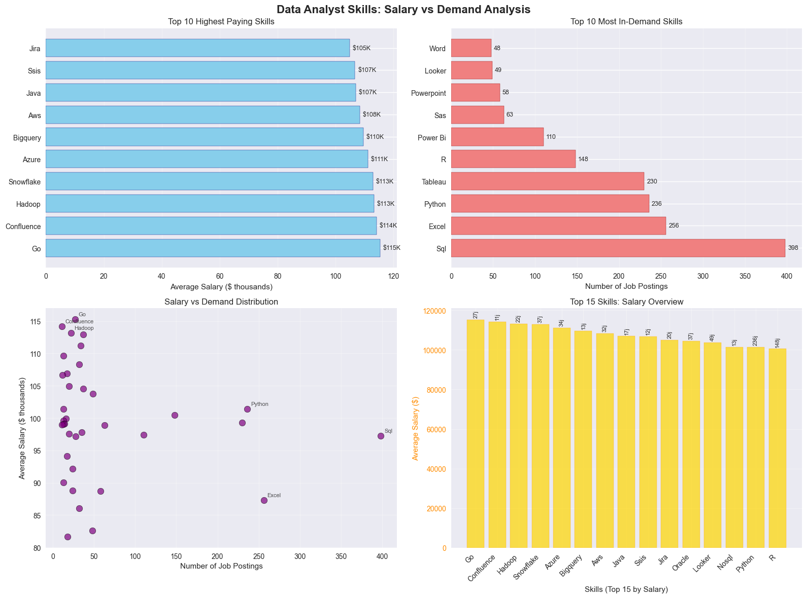

# 📌 Introduction
This project explores the job market for **Data Analyst** roles using **SQL**. By analyzing job postings, salaries, and required skills, it provides insights into the most valuable skills for career growth, the top-paying opportunities, and how specific skills influence salary levels.

# 📖 Background
As the demand for data professionals grows, job seekers often face uncertainty about which skills to focus on. The goal of this analysis is to answer key career-related questions for aspiring or current Data Analysts:

-  Which skills are **most in demand**?  
-  Which skills are linked to the **highest salaries**?  
-  What skills are required for **top-paying jobs**?  
-  What are the **top remote opportunities** in the market?  

By answering these questions, this project provides actionable insights for career development in data analytics.
# 🛠️ Tools I Used
- **SQL** (PostgreSQL dialect) → For querying and analyzing job postings
- **GitHub** → To share, version, and document the analysis

# 📊 The Analysis
I wrote and ran **five main SQL queries**:  

1. **Optimal Skills to Learn**  
   - Identified skills in high demand with high average salaries  
   - Focused on **remote jobs with specified salaries**  
```sql
SELECT
    skills_dim.skill_id,
    skills_dim.skills,
    COUNT(skills_job_dim.job_id) AS demand_count,
    ROUND(AVG(job_postings_fact.salary_year_avg),0) AS avg_salary
FROM
    job_postings_fact
INNER JOIN skills_job_dim ON job_postings_fact.job_id = skills_job_dim.job_id
INNER JOIN skills_dim ON skills_job_dim.skill_id = skills_dim.skill_id
WHERE
    job_title_short = 'Data Analyst'
    AND salary_year_avg IS NOT NULL
    AND job_work_from_home = TRUE
GROUP BY
    skills_dim.skill_id
HAVING
    COUNT(skills_job_dim.job_id) > 10
ORDER BY
    avg_salary DESC,
    demand_count DESC
LIMIT 25;
```


*The data analyst job market shows a clear career strategy: start with high-demand foundation skills like SQL, Python, and Excel to get your foot in the door, then strategically add cloud platforms like AWS, Azure, or Snowflake for salary boosts. While niche skills like Go or Hadoop pay the most, they have very limited job opportunities, so the smartest approach combines Python, Tableau, and a cloud platform for the best balance of demand and pay. The market reality is straightforward - core data skills drive most job opportunities, cloud platforms offer the sweet spot of good salary and decent demand, and visualization tools are becoming essential, perfectly illustrating the classic trade-off between specialization and market accessibility in the data field.*

2. **Most In-Demand Skills**  
   - Found the **top 5 most requested skills** for Data Analysts  
   - Based on total demand across all postings  
```sql
SELECT
    skills,
    COUNT(skills_job_dim.job_id) AS demand_count
FROM
    job_postings_fact
INNER JOIN
    skills_job_dim ON job_postings_fact.job_id = skills_job_dim.job_id
INNER JOIN
    skills_dim ON skills_job_dim.skill_id = skills_dim.skill_id
WHERE
    job_title_short = 'Data Analyst' AND
    job_work_from_home = TRUE
GROUP BY
    skills
ORDER BY   
    demand_count DESC
LIMIT 5
```

*The chart shows the top 5 most in-demand skills for data analysts. SQL is the most required skill, appearing in 7,291 job postings and making up about 32.3% of the demand. Excel follows with 4,611 postings (20.4%), then Python with 4,330 (19.2%), Tableau with 3,745 (16.6%), and Power BI with 2,609 (11.6%). Overall, SQL clearly leads the market, while Excel and Python are also highly valued. Tableau and Power BI are important but in lower demand compared to the others.*

3. **Skills Required for Top-Paying Jobs**  
   - Looked at the **top 10 highest-paying Data Analyst roles**  
   - Listed the skills required for those roles  
``` sql
WITH top_paying_jobs AS(
SELECT 
    job_id,
    job_title,
    salary_year_avg,
    name AS company_name
FROM
    job_postings_fact
LEFT JOIN 
    company_dim ON job_postings_fact.company_id = company_dim.company_id
WHERE
    job_title_short = 'Data Analyst' AND
    job_location = 'Anywhere' AND
    salary_year_avg IS NOT NULL
ORDER BY
    salary_year_avg DESC
LIMIT 10
)

SELECT 
    top_paying_jobs.*,
    skills
FROM
    top_paying_jobs
INNER JOIN skills_job_dim ON top_paying_jobs.job_id = skills_job_dim.job_id
INNER JOIN skills_dim ON skills_job_dim.skill_id = skills_dim.skill_id
ORDER BY
    salary_year_avg DESC
LIMIT 10
```


*This chart shows an analysis of the top paying data analyst jobs. The highest salaries range from about $184K to $255K, with companies like AT&T, Pinterest, and Uclahealthcare among the leaders. The most in-demand skills in these top jobs are SQL, Python, and Tableau, while others like Excel, Pandas, Snowflake, and Confluence also appear. On average, skills such as Excel, Pandas, and R are linked with salaries around $215K, while Confluence and Snowflake have lower averages. The salary distribution highlights that most top jobs cluster around $190K–$210K, with the mean salary at $207K and the median at $197K.*

4. **Top-Paying Jobs**  
   - Isolated the **10 best-paying Data Analyst jobs**  
   - Focused on **remote roles with salaries listed**  
``` sql
SELECT 
    job_id,
    job_title,
    job_location,
    job_schedule_type,
    salary_year_avg,
    job_posted_date,
    name AS company_name
FROM
    job_postings_fact
LEFT JOIN 
    company_dim ON job_postings_fact.company_id = company_dim.company_id
WHERE
    job_title_short = 'Data Analyst' AND
    job_location = 'Anywhere' AND
    salary_year_avg IS NOT NULL
ORDER BY
    salary_year_avg DESC
LIMIT 10
```


*This chart highlights the top 10 highest-paying data analyst jobs. The company Mantys leads with a salary of $650K, followed by Meta at $336K, and AT&T at $255K. Most other companies, like Pinterest, Uclahealthcare, and SmartAsset, offer salaries between $184K–$232K. The salary distribution shows that while most jobs fall between $180K–$250K, a couple of outliers (Mantys and Meta) push the mean salary higher to $264K, compared to a median of $211K. All top-paying roles are full-time positions, with an average salary of $264K across these jobs.*

5. **Top Skills by Salary**  
   - Calculated the average salary associated with each skill  
   - Highlighted the **5 skills most correlated with higher salaries**  
```sql
SELECT
    skills,
    ROUND(AVG(salary_year_avg), 0) AS avg_salary
FROM
    job_postings_fact
INNER JOIN
    skills_job_dim ON job_postings_fact.job_id = skills_job_dim.job_id
INNER JOIN
    skills_dim ON skills_job_dim.skill_id = skills_dim.skill_id
WHERE
    job_title_short = 'Data Analyst' 
    AND salary_year_avg IS NOT NULL
GROUP BY
    skills
ORDER BY   
    avg_salary DESC
LIMIT 5
```

*This chart analyzes the top skills for data analyst roles based on salary. The highest-paying skill is SVN, with an average salary of $400K, far above all others. Other high-paying skills include Solidity ($179K), Couchbase ($160K), Datarobot ($155K), and Golang ($155K), all exceeding the overall average of $144K. Most skills, however, cluster in the $115K–$160K range, while only a few stand out in much higher brackets. The salary distribution confirms that most skills fall in lower ranges, with just one outlier at the very top (SVN). This suggests that while rare, some niche technical skills can command exceptionally high salaries, even if demand for them is limited.*
# 🎯 What I Learned
- 🏆 **SQL, Python, and Tableau** are consistently the most in-demand skills  
- 💰 Specialized/niche skills can **boost salaries**, even if demand is lower  
- 🌍 Remote postings with salary data provide clearer insights into **market value**  
- 📈 Looking at **demand + salary** gives the best strategy for career growth  

# ✅ Conclusions
- **SQL, Python, and Excel** remain essential, must-have skills  
- **High-paying jobs** often require **cloud tools, advanced programming, or BI platforms**  
- Balancing **core in-demand skills** with **specialized high-paying skills** is the best career strategy  
- Remote opportunities are strong if candidates have the **right skill mix** 
---

👨‍💻 *This project highlights how SQL can be used to analyze real-world job market data and provide strategic insights for career planning.*  